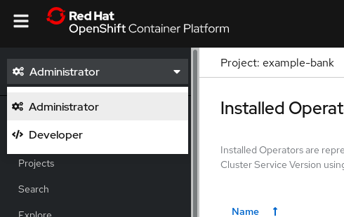
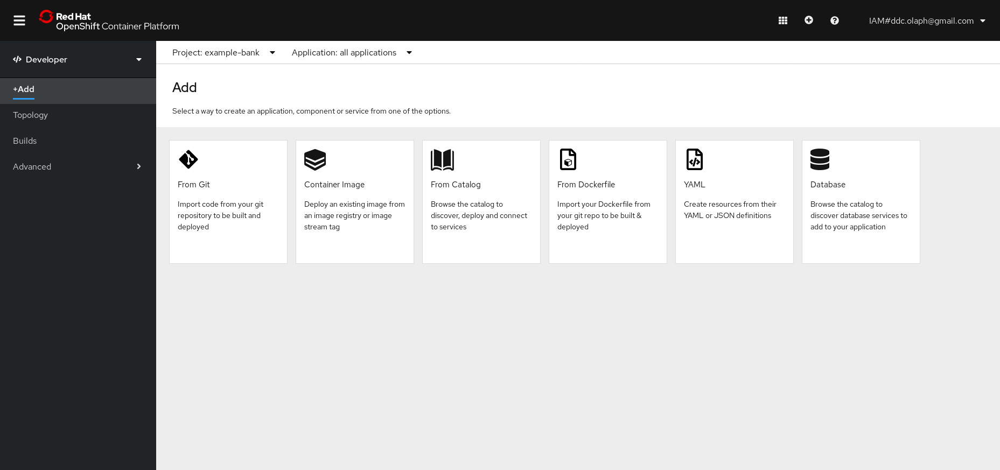
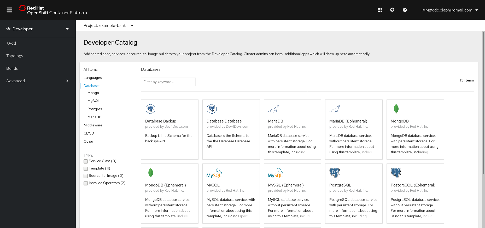
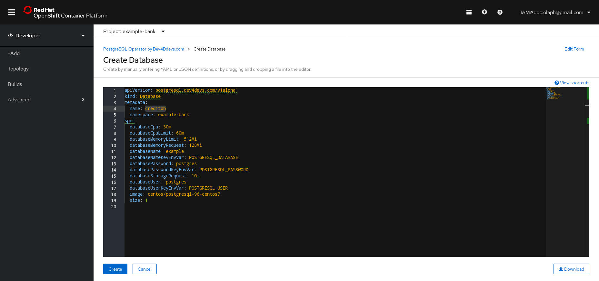
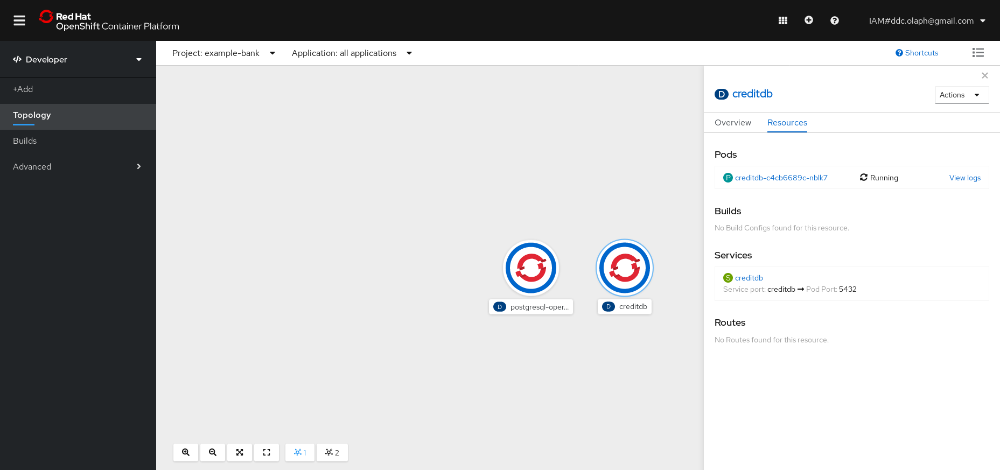

Use the very top drop down in the navigation menu on the left to switch to *Developer** view

Click **+Add** and select the Database tile

Choose the **Database Database** tile and then **Create**

You can edit some of the specifics of the database here.  For example, change the name to `creditdb` and click **Create**

Switch to the Topology tab, and watch your database creation complete!

