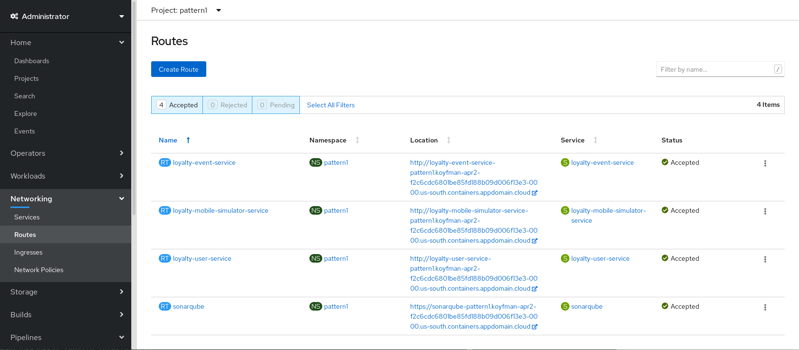
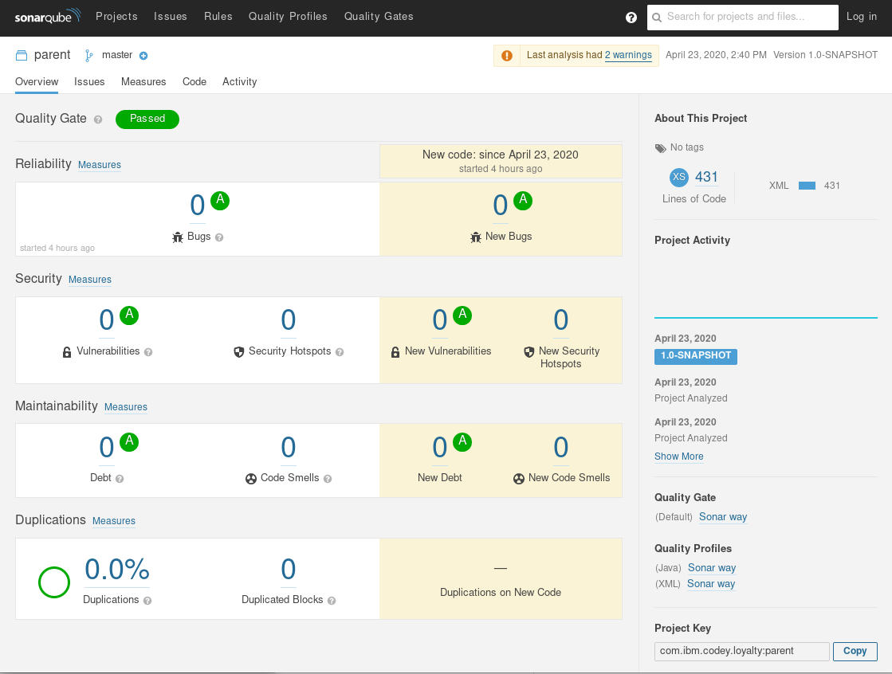
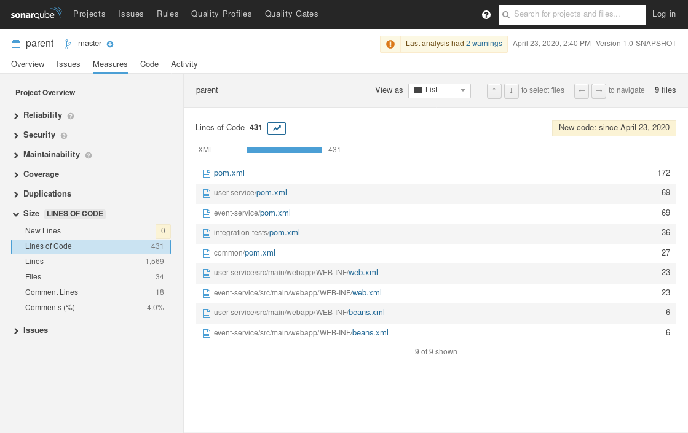
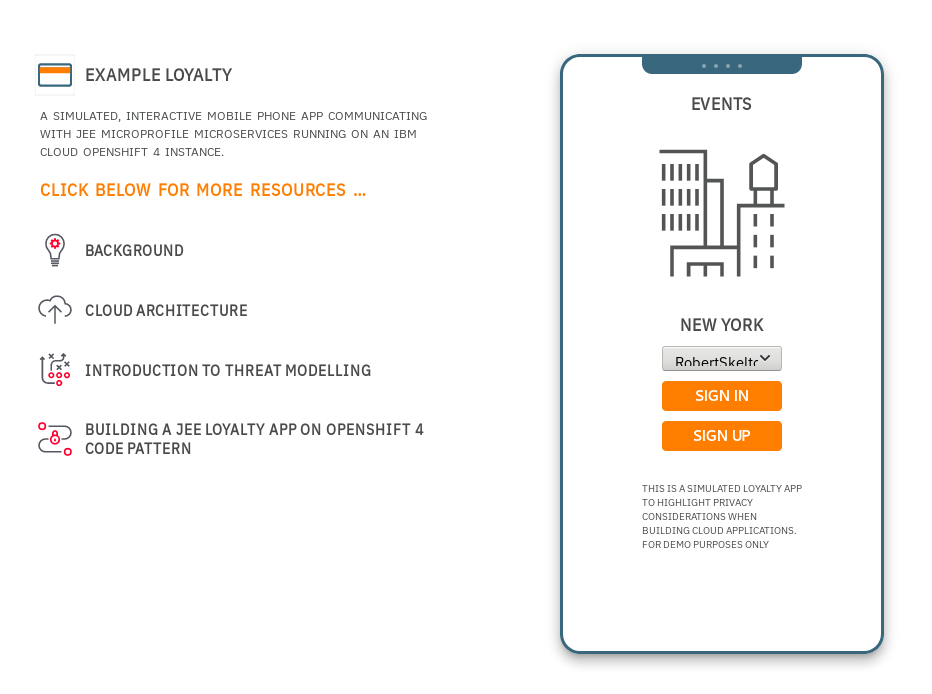

The back end of Example Bank is what this tutorial deploys through a pipeline. It consists of several microservices, including two Java services to process transactions and users respectively, a Node.js front end, and a PostgresSQL instance to keep track of it all.

### 1. Install Tekton

Next up, Tekton installation.  From the navigation menu on the left of your OpenShift web console, select **Operators** --> **Operators Hub** and then search for the **OpenShift Pipelines Operator**.  Click on the tile and then the subsiquent **Install** button.  Keep the default settings on the **Create Operator Subscription** page and click **Subscribe**.

### 2. Create a new project

Back in your local console, let us separate the tools from the application by creating a new project:

```bash
oc new-project bank-infra
```

### 3. Create a service account

To make sure the pipeline has the appropriate permissions to store images in the local OpenShift registry, you need to create a service account. For this tutorial, call it "pipeline".

```
oc create serviceaccount pipeline
oc adm policy add-scc-to-user privileged -z pipeline
oc adm policy add-role-to-user edit -z pipeline
oc policy add-role-to-user edit system:serviceaccount:bank-infra:pipeline -n example-bank
```

That last command grants your service account access to the `example-bank` project. You should have created it as part of the prerequisites.

### 4. Install tasks

Tekton Pipelines are essentially a chain of of individual tasks. This tutorial uses serveral tasks, but you can install them all at once by cloning the main code pattern repo and then targeting the `pipelines/tasks` folder:

```bash
cd ../pipeline
oc apply -f tasks

```

### 5. Create the pipeline

The pipeline file (`example-bank-pipeline.yaml`) links together all the tasks of your pipeline, in this case consisting of: code scanning, building code into an image, and then deploying and exposing those images.

```
kubectl apply -f example-bank-pipeline.yaml
```

## Steps for threat testing

Did I say code scanning? Let’s take this exercise in creating a pipeline a step further and introduce threat testing by including an application called SonarQube. SonarQube is open source software for inspecting a code base. It supports a plethora of languages. SonarQube can report on bugs and security vulnerabilities, as well as other helpful areas like code coverage and unit tests. This tutorial uses SonarQube to test code for vulnerabilities.

### 1. Deploy an instance of SonarQube

Another file in the repo describes all the settings needed for a deployment of SonarQube. A **Deployment** lists all the volumes and mount paths SonarQube requires. Additionally, a **Service** and **Route** allow the app to be publicly accessible. One file contains all this information:

```bash
oc apply -f sonarqube.yaml
```

### 2. Create a PVC

You also need a Persistant Volume Claim. It allows the tasks in the pipeline to have a common place to write information to share with one another:

```
oc apply -f bank-pvc.yaml
```

### 3. Run the pipeline

Finally, with your vulnerability scanner in place, you can run your financial pipeline using a **PipelineRun** file:

```
oc create -f bank-pipelinerun.yaml
```

Anytime you need to rescan and/or redeploy your code base, simply run that command.

## Results

Now to enjoy the fruits of our labor! SonarQube has its own web interface. To get to it, navigate to the `bank-infra` project in the OpenShift web console. From the menu on the left, select **Networking** and then **Routes**:



Select the URL for SonarQube and check out the stats for your installation:



All green! Since there are no vulnerabilites here, you can click through to check out the stats for the lines of code:



Back on the **Routes** page, you can also find the URL for the user interface of your freshly installed Example Bank app. For the `loyalty-mobile-simulator-service`:


